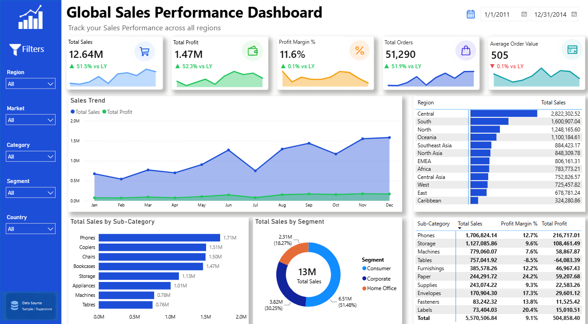

# Global Sales Performance Dashboard

## Project Overview
This project analyzes the Global Superstore dataset using Excel, MySQL, and Power BI. The dashboard provides insights into sales, profit, orders, regions, products, and customer segments.

## Business Problem
Businesses need a clear understanding of sales performance, profit trends, and regional performance to make better decisions.

## Tools Used
- Excel
- MySQL
- Power BI

## Dataset
Global Superstore Dataset

## Dashboard Preview

## Dashboard Features
- Total Sales
- Total Profit
- Profit Margin %
- Total Orders
- Average Order Value
- Sales Trend
- Sales by Region
- Sales by Sub-Category
- Sales by Segment

## Project Structure
- Dashboard
- Dataset
- SQL Queries
- Business Requirement Document
- Data Audit Report
- Dashboard Screenshot

## Key Insights
- Technology generated the highest sales.
- Consumer segment contributed the largest share.
- Sales increased over time.
- Some sub-categories had low profit margins despite high sales.

## Author
Rahul Bansal
